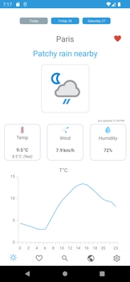
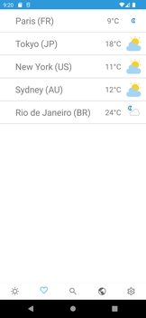
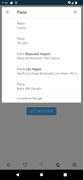
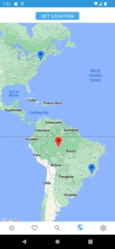

# KuteWeather
An Android Weather Application coded in Kotlin. It is a project for educational purpose so the code won't be maintained for future Android APIs.

<div>
  <a href="screenshots/home.png" target="_blank"></a>
  &nbsp;
  <a href="screenshots/favourites.png" target="_blank"></a>
  &nbsp;
  <a href="screenshots/googlesearch.png" target="_blank"></a>
  &nbsp;
  <a href="screenshots/maps.png" target="_blank"></a>
  &nbsp;
</div>

# Features
* API REST weatherapi.com (hardcoded key included)
* Geocoding by Google API
* GPS localization
* Google Maps
* AnyChart used for charts
* Battery Friendly

# Requirements
* Android 7.0 +
* GPS enabled

# Release
An unsigned APK can be downloaded <a href="https://github.com/kimtd09/KuteWeather/releases">here</a>

# How to build your own APK
Import the source code in android studio and add your google API key in the local.properties file
```
MAPS_API_KEY=A*************************************Q
```
